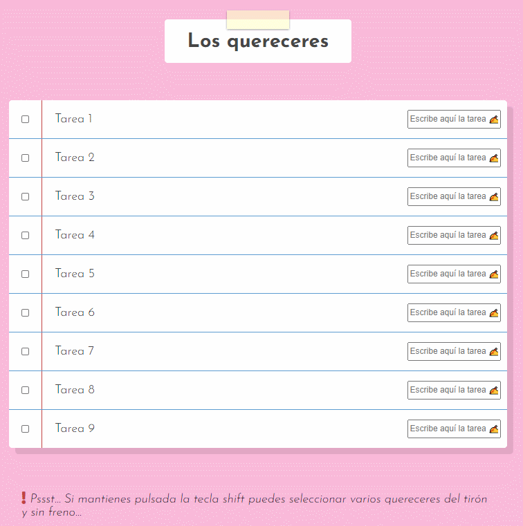

# [Wes Bos' 30 days Vanilla JS challenge](https://javascript30.com/)

## `No frameworks, no compilers, no fuss;`

### **[Day 10: Checkboxes task list](https://2y2son4.github.io/customizable-task-list/)**.

#### **JS**

- [.forEach()](https://developer.mozilla.org/en-US/docs/Web/JavaScript/Reference/Global_Objects/Array/forEach)
- [for...of](https://developer.mozilla.org/en-US/docs/Web/JavaScript/Reference/Statements/for...of)
- [localStorage.setItem()](https://developer.mozilla.org/en-US/docs/Web/API/Storage/setItem)
- [localStorage.getItem()](https://developer.mozilla.org/en-US/docs/Web/API/Storage/getItem)
- [JSON.stringify()](https://developer.mozilla.org/en-US/docs/Web/JavaScript/Reference/Global_Objects/JSON/stringify)

Click here to check the <strong>layout</strong>.

